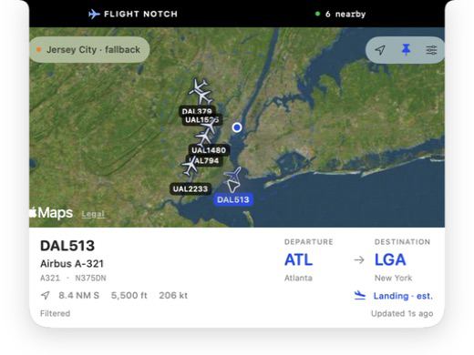
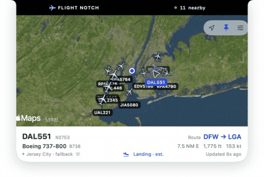
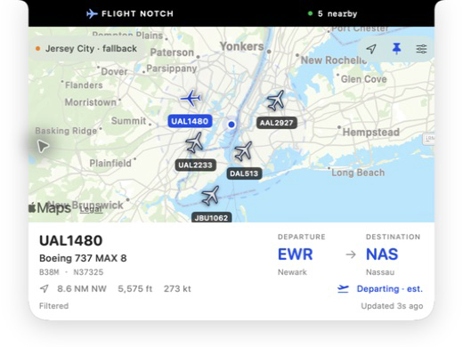
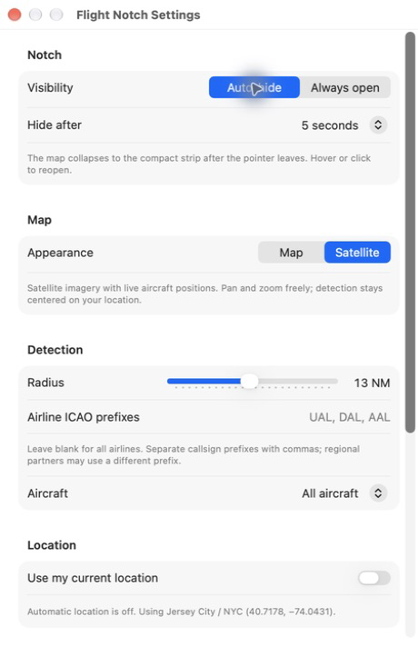

# Flight Notch

**See the aircraft overhead, right from your Mac's notch.**

A small native macOS flight tracker with a live map, satellite imagery, aircraft details, and departure/destination estimates. Hover to open it, select a flight, and let it tuck away when you're done.

No API keys. No paid API subscription. No backend to run.



## In action



[Watch or download the 25-second MP4 recording](docs/media/demo.mp4).

These captures show the app using its fixed public Jersey City center with automatic location disabled. They contain no personal desktop, other applications, audio, or actual user location.

## What it does

- **Live nearby aircraft:** positions refresh every eight seconds, with visible update status and automatic retry backoff.
- **Map and satellite:** pan, zoom, and recenter without changing your detection area.
- **Flight labels:** each aircraft shows its broadcast callsign, or registration when no callsign is transmitted. The selected aircraft turns blue and stays in front.
- **Relative aircraft sizes:** light aircraft and regional jets have smaller icons than airliners and heavy jets. Icons rotate with the reported track.
- **Aircraft details:** type, registration, distance, altitude, speed, estimated phase, and route airports when available.
- **Location awareness:** macOS determines your location and the app shows the city name. A clearly labeled Jersey City fallback works without permission.
- **Compact controls:** radius, airline/type filters, location, map style, and feed selection live in Settings.
- **Auto-hide or Always open:** collapse after 3, 5, 10, or 30 seconds, or pin the map open. Preferences survive restarts.
- **Native macOS:** SwiftUI, MapKit, and CoreLocation. Works as a top-center strip on displays without a notch; respects Reduce Motion.

<details>
<summary>More screenshots</summary>

### Standard map



### Settings



</details>

## Build and run

You need **macOS 14 or later**, **Xcode 26 or later**, and an internet connection. Open Xcode once to finish installing its components. The verified local toolchain is Xcode 26.6 / Swift 6.

```sh
git clone https://github.com/jiahongc/flight-notch.git
cd flight-notch
./build.sh
open "$HOME/Library/Caches/FlightNotch/DerivedData/Build/Products/Release/Flight Notch.app"
```

For development, open **FlightNotch.xcodeproj** and choose the **FlightNotch** scheme. The original `boringNotch.xcodeproj` is upstream reference and does not build this app.

The build uses local ad-hoc signing, including the location entitlement. No Apple developer account, signing certificate, Swift package download, or API account is required. The script verifies the signed location entitlement before reporting success.

Build products stay in `~/Library/Caches/FlightNotch` because Desktop/iCloud File Provider metadata can interfere with codesigning. Set `FLIGHT_NOTCH_BUILD_DIR` to use a different build directory.

This is a source distribution. Builds are locally signed, not notarized; there is no published binary installer yet.

## Use it

| Control | Action |
| --- | --- |
| Hover or click the compact strip | Open the aircraft map |
| Click an aircraft | Select it and show its details |
| Location arrow | Recenter the map on the detection area |
| Pin | Switch between Always open and auto-hide |
| Sliders button | Open Settings above the notch |
| Airplane menu-bar icon | Show flights, open Settings, pause/resume, or quit |

The default hide delay is five seconds after the pointer leaves. Auto-hide collapses the map to the compact strip; it does not quit tracking. Settings temporarily collapses the map so the window stays unobstructed.

Filter within **2–25 nautical miles**, by **airline ICAO prefixes** such as `UAL, DAL, AAL`, or by aircraft class. Regional partners may broadcast a different prefix from the passenger-facing airline. Labels use the actual broadcast identity rather than guessing a marketing flight number. When neither callsign nor registration is available, the aircraft's hex identifier is shown.

## Location and privacy

Allow the macOS location prompt to find flights around you. When permission is granted, the app resolves the detected position to a city name. It does not save a location or flight history.

If location is unavailable:

1. Open **Flight Notch Settings → Location → Location permissions**.
2. Enable **Location Services** and **Flight Notch** in macOS System Settings.
3. Turn on Wi-Fi if macOS cannot obtain a fix, then choose **Find my location**.

Until a fix is available, the map explicitly uses the built-in Jersey City center. Turning off **Use my current location** also selects that fallback. A temporary positioning error retains the last detected location instead of jumping to another city.

| Service | Information sent |
| --- | --- |
| Selected aircraft feed | Detection coordinates and radius |
| Apple MapKit / CoreLocation | Map and location/geocoding requests |
| ADSB.im | Selected aircraft's public callsign and aircraft coordinates |

Preferences stay in local UserDefaults. There is no app account, analytics SDK, telemetry backend, or paid service credential. Provider information is available in Settings without crowding the map footer.

## Data sources and limits

**Aircraft positions:** [adsb.fi](https://github.com/adsbfi/opendata) is the default. Its public API documents one request per second for personal, non-commercial use; Flight Notch requests every eight seconds. [adsb.lol](https://github.com/adsblol/api) is an alternative with dynamic limits. Coverage and service availability vary. No paid API is required, but each provider's terms still apply.

Position requests do not overlap. Errors back off, `Retry-After` is respected, and provider cooldowns survive restarts. Repeated access/rate-limit errors pause tracking. Positions older than 60 seconds are hidden.

**Routes:** [ADSB.im](https://adsb.im/using) combines aircraft messages and historical tracks. The selected callsign and aircraft position are checked, new requests are spaced at least four seconds apart, and the open map retries once a minute. Successful results are cached in memory for five minutes; missing results for one minute. Invalid or clearly implausible routes are hidden. Multi-stop itineraries display all airports under **Route stops** because the current leg is not confirmed.

Routes are **estimates, not confirmed flight plans**. Private flights, diversions, and changed assignments may have no usable route. Missing airports are never invented.

**Map imagery:** Apple MapKit supplies the standard map and satellite imagery. Satellite imagery is not live video. Apple Maps attribution remains visible.

**Aircraft size and phase:** icon size is a visual approximation from aircraft family and ADS-B emitter category, not exact wingspan or map scale. Landing/departing labels are altitude/vertical-speed estimates, not confirmation of a runway or flight plan. Distances are horizontal nautical miles.

## Development

```sh
swift test
./build.sh
```

The tests cover ADS-B decoding, geometry, filters, stale positions, feed errors and cooldowns, route matching and plausibility, aircraft sizing, auto-hide timing, and Settings visibility. The GitHub Actions workflow runs the same checks on pull requests and can be started manually. It does not publish releases or require repository secrets.

| Path | Purpose |
| --- | --- |
| `FlightNotch/` | Flight models, feed/route clients, location, map UI, and app lifecycle |
| `FlightNotchTests/` | Focused model, network-stub, and interaction tests |
| `FlightNotch.xcodeproj/` | Standalone app target with no external package dependencies |
| `docs/media/` | Reviewed screenshots and short app-only demo |
| `boringNotch/` and original support directories | Retained upstream source/reference; only the panel and notch shape are compiled into Flight Notch |

See [CONTRIBUTING.md](CONTRIBUTING.md) for development guidance and [SECURITY.md](SECURITY.md) for reporting security issues.

## Credits and license

Flight Notch is adapted from [Boring Notch](https://github.com/TheBoredTeam/boring.notch) under the [GNU GPL-3.0 license](LICENSE). It reuses Boring Notch's panel behavior and notch geometry; original authorship notices and [third-party licenses](THIRD_PARTY_LICENSES) remain intact. The notch shape credits DynamicNotchKit by Kai Azim.

The upstream media, shelf, calendar, private SkyLight/XPC services, updater, and package dependencies are not compiled or started by Flight Notch. This project is independent of the aircraft data providers and Apple.
